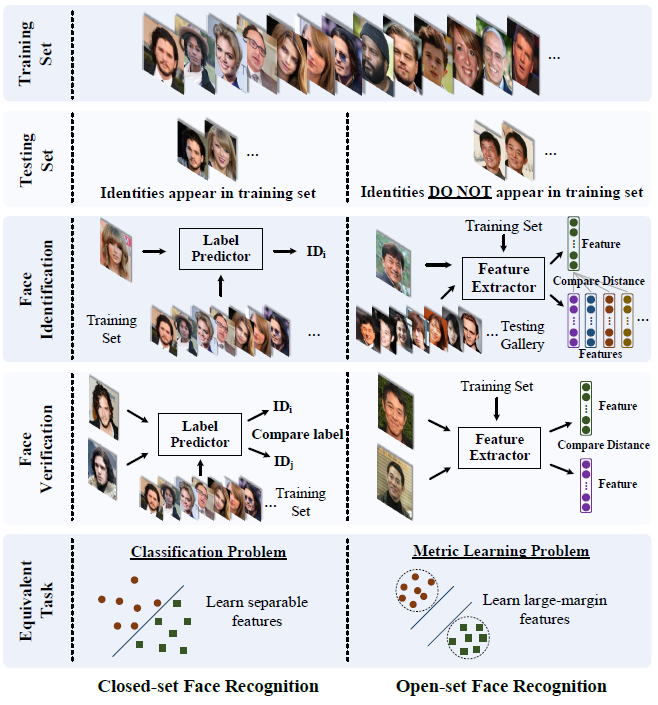
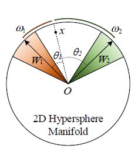
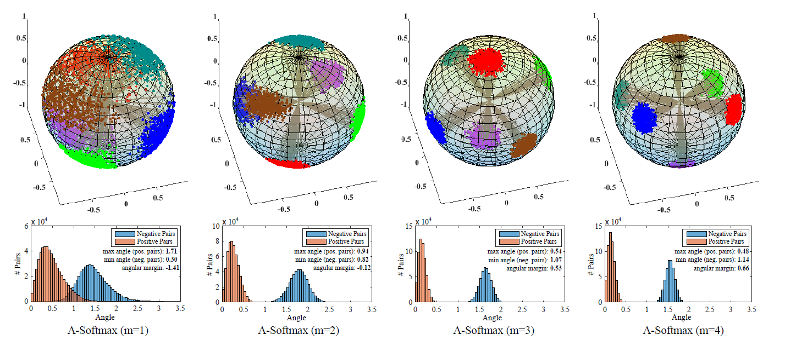

# SphereFace

SphereFace: Deep Hypersphere Embedding for Face Recognition
{:.faded}

## Introduction

### Testing Protocol

#### Closed-set

- all testing identities are predefined in training set
- face verification is equivalent to performing identification for a pair of faces respectively
- can be well addressed as a classification problem

#### Open-set

- the testing identities are usually disjoint from the training set, close to practice
- face identification can be viewed as performing face verification between the probe face and every identity
- Open-set FR is essentially a metric learning problem, where the key is to learn discriminative large-margin features

  

### Previous works

The basic rule is making maximal intra-class distance smaller than the minimal inter-class distance

1. Some pioneering work learn face features via the softmax loss
2. combine softmax loss with contrastive loss or center loss
3. adopts triplet loss to supervise the embedding learning.

...

these works are both time-consuming and performance sensitive

## Deep Hypersphere Embedding

### Softmax Loss

[Post about Softmax Loss](../ml-alg/2021-07-15-softmax-loss.md)
{:.heading.flip-title.related-posts.faded}

### Introducing Angular Margin

- the decision boundaries on the hyperspace can greatly affect the feature distribution
- so the basic idea is to **manipulate decision boundaries** to produce angular margin

softmax loss reqires

$$
\cos \theta_1 > \space \cos \theta_2
$$

but if we instead require

$$
\cos (m\theta_1) > \space \cos (\theta_2)
$$

From angular perspective, correctly classifying $$x$$ from class 1 requires

$$ \theta_1 < \cfrac{\theta_2}{m} $$

it is more difficult than original $$ \theta_1 < \theta_2 $$, makes the decision more stringent

such decision boundaries will produce an angular margin 

$$
\cfrac{m-1}{m+1} \theta_1^2
$$ 

where $$\theta_1^2$$ is the angle between $$W1$$ and $$W2$$

In addition, derive lower bounds for the parameter $$m$$ to approximate the desired criterion[^1]

[^1]: maximal intra-class distance should be smaller than the minimal inter-class distance.

{:style='width:30%; margin:0% 35%;' loading='lazy'}

Geometric interpretation of A-softmax Loss
{:.figcaption}

## Experiments

### Training

- use CASIA-WebFace dataset(0.49M ≈ 490,000)
- These face images are horizontally flipped for data augmentation

### Testing

1. extract the deep features from the output of the FC1 layer. 
2. the final representation of a testing face is obtained by concatenating its original face features and its horizontally flipped features.
3. The score is computed by the cosine distance of two features.

The cloud of the point shrinks when m gets bigger
{:.figcaption}
